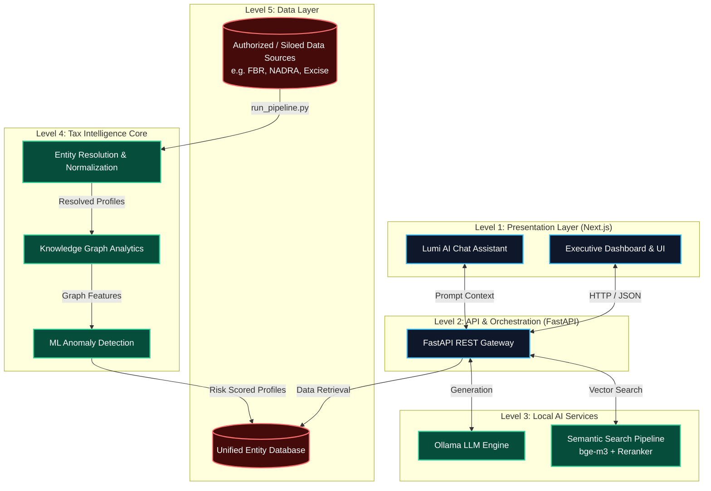

# TaxIntel AI

> Enterprise-grade AI-powered Tax Compliance & Intelligence Platform for Pakistan

[](https://nextjs.org)
[](https://fastapi.tiangolo.com)
[](https://ollama.com)
[](https://python.org)

---

### AI-Powered Tax Intelligence & Entity Resolution for Pakistan

TaxIntel AI is an AI-powered intelligence platform designed to help authorized organizations analyze fragmented financial, asset, utility, travel, business, and tax records.

It uses **entity resolution, multilingual matching, machine learning, anomaly detection, knowledge graphs, semantic search, and local LLM intelligence** to transform disconnected records into unified profiles and explainable risk indicators.

> **TaxIntel does not determine guilt or tax liability. It identifies analytical indicators and relationships that require human investigation.**

---

## 🎯 The Problem

Relevant information about an individual or business can exist across multiple disconnected datasets:

* Tax records
* Property ownership
* Vehicle registrations
* Banking indicators
* Utility consumption
* Mobile records
* Travel history
* Business records

The same person may appear under different spellings, phone numbers, addresses, or transliterations.

Traditional database matching struggles with this fragmentation.

### TaxIntel's approach

**Fragmented Records → Entity Resolution → Unified Profiles → AI Analysis → Risk Intelligence**

---

## 🧠 What Makes TaxIntel Different?

TaxIntel is not simply a dashboard or chatbot.

### 1. Intelligent Entity Resolution

The system identifies records that likely belong to the same real-world entity using:

* CNIC normalization
* NTN matching
* Phone normalization
* Name similarity
* Father-name similarity
* Address normalization
* Phonetic matching
* City-aware blocking
* Fuzzy matching
* Confidence scoring

Instead of comparing every record with every other record, TaxIntel uses **blocking and candidate generation** to reduce unnecessary comparisons and improve scalability.

---

### 2. Multilingual & Noisy Data Matching

Pakistan's data can contain:

* English / Urdu names
* Different transliterations
* Spelling variations
* Missing fields
* Formatting differences
* Inconsistent addresses
* Different phone formats

TaxIntel normalizes and compares these variations before generating entity matches.

---

### 3. AI-Based Anomaly Detection

TaxIntel combines multiple signals to identify unusual patterns such as:

* Declared income vs. estimated assets
* Property and vehicle ownership
* Utility consumption
* Business activity
* Travel activity
* Financial indicators
* Cross-dataset inconsistencies

These signals contribute to an **explainable risk profile**, rather than a simple black-box prediction.

---

### 4. Knowledge Graph Intelligence

Resolved entities and relationships are represented as a graph.

This makes it possible to analyze relationships between:

**People → Businesses → Vehicles → Properties → Utilities → Financial Indicators**

Graph analysis can reveal connected entities, communities, shared attributes, and potentially significant relationships that are difficult to see in isolated tables.

---

### 5. Lumi AI Assistant

TaxIntel includes an AI assistant called **Lumi**.

Lumi can help investigators explore processed intelligence using natural language and retrieve relevant context from the system.

The assistant is designed as an **analytical interface**, not an autonomous decision-maker.

---

# 🏗️ System Architecture



---

# 🔄 Intelligence Pipeline

```text
Authorized Data Uploads
        ↓
Schema Detection & Validation
        ↓
Data Cleaning & Normalization
        ↓
Blocking & Candidate Generation
        ↓
Entity Resolution
        ↓
Unified Entity Profiles
        ↓
Feature Engineering
        ↓
ML Anomaly Detection
        ↓
Risk & Tax-Gap Indicators
        ↓
Knowledge Graph Analysis
        ↓
Semantic Intelligence
        ↓
Executive Dashboard + Lumi
```

---

# 🧩 Core Intelligence Engine

### Entity Resolution

TaxIntel uses a layered matching architecture:

```text
Raw Records
    ↓
Normalization
    ↓
Blocking
 ┌───────────────┐
 │ CNIC / NTN    │
 │ Phone         │
 │ Name          │
 │ Phonetic+City │
 │ Name+Father   │
 └───────────────┘
    ↓
Candidate Pairs
    ↓
Similarity Scoring
    ↓
Confidence Decision
    ↓
Entity Clustering
    ↓
Unified Profiles
```

Blocking prevents the system from performing expensive full **O(N²)** comparisons across large datasets.

---

# 🤖 AI / ML Stack

| Component           | Technology                                  |
| ------------------- | ------------------------------------------- |
| Entity Resolution   | RapidFuzz + custom matching engine          |
| Blocking            | Exact + phonetic + attribute-based blocking |
| Anomaly Detection   | Isolation Forest                            |
| Risk Modeling       | XGBoost                                     |
| Explainability      | SHAP                                        |
| Semantic Search     | BGE-M3 + reranking                          |
| Local LLM           | Ollama + Qwen                               |
| Knowledge Graph     | NetworkX                                    |
| Community Detection | Graph-based clustering                      |
| Data Processing     | Pandas / NumPy                              |
| API                 | FastAPI                                     |
| Frontend            | Next.js + React                             |
| Visualization       | Plotly / graph visualization                |

---

# 📊 Risk Intelligence

TaxIntel combines multiple analytical signals rather than relying on a single field.

Example:

```text
Declared Income
      +
Property Holdings
      +
Vehicle Holdings
      +
Utility Consumption
      +
Business Activity
      +
Travel Indicators
      ↓
Feature Engineering
      ↓
ML + Statistical Analysis
      ↓
Risk Indicators
      ↓
Explainable Intelligence Profile
```

The resulting profile can help an authorized analyst prioritize records for further review.

---

# 📁 Data Ingestion

TaxIntel is designed around **uploaded/authorized datasets** rather than fabricated production claims.

Supported formats include:

* CSV
* XLSX

The ingestion layer automatically performs:

* Schema detection
* Column mapping
* Type normalization
* Missing-value handling
* Identifier normalization
* Data-quality checks
* ETL processing

The architecture can accommodate different institutional datasets without requiring the source systems to have identical schemas.

---

# 🖥️ Product Architecture

### Frontend

**Next.js + React**

Provides:

* Executive dashboard
* Entity intelligence profiles
* Risk visualization
* Network/relationship exploration
* Search
* AI assistant interface

### Backend

**FastAPI**

Handles:

* API routing
* Data retrieval
* Intelligence services
* LLM orchestration
* Search
* Dashboard endpoints

### Intelligence Core

Python-based processing engine containing:

* Data ingestion
* Entity resolution
* Feature engineering
* Machine learning
* Risk scoring
* Knowledge graph analytics

---

# 🛠️ Technology Stack

**Frontend**

* Next.js
* React
* Tailwind CSS

**Backend**

* FastAPI
* Python

**AI / ML**

* Ollama
* Qwen
* scikit-learn
* XGBoost
* SHAP
* BGE-M3
* Reranking models

**Data & Graph**

* Pandas
* NumPy
* NetworkX

**DevOps**

* Git
* GitHub Actions
* Automated linting / testing

---

# 🚀 Quick Start

## 1. Clone the repository

```bash
git clone <repository-url>
cd TaxIntel
```

## 2. Install Python dependencies

```bash
pip install -r requirements.txt
```

## 3. Configure local AI

Install Ollama and pull the configured Qwen model.

```bash
ollama pull qwen2.5:3b
```

Start Ollama:

```bash
ollama serve
```

## 4. Add authorized datasets

Place CSV/XLSX files in the configured upload/data directory or upload them through the application.

## 5. Run the intelligence pipeline

```bash
python run_pipeline.py
```

## 6. Start the API

```bash
uvicorn backend.main:app --reload
```

## 7. Start the frontend

```bash
cd frontend
npm install
npm run dev
```

---

# 🔐 Responsible Use

TaxIntel is intended for **authorized analytical and investigative workflows**.

The system:

* Does not establish criminal liability
* Does not automatically determine tax evasion
* Does not replace human investigators
* Requires lawful access to source data
* Produces indicators and confidence scores for human review

Any real-world deployment would require appropriate authorization, privacy controls, auditing, access control, and compliance with applicable Pakistani law and institutional policies.

---

# 🇵🇰 Why TaxIntel for Pakistan?

Pakistan has highly fragmented information systems and large volumes of records distributed across different organizations.

TaxIntel demonstrates how modern AI can help transform fragmented data into actionable intelligence through:

**Entity Resolution + Machine Learning + Knowledge Graphs + Semantic AI**

The long-term vision is to provide authorized institutions with a scalable intelligence layer capable of finding relationships and inconsistencies that conventional database queries may miss.

---

# 🔮 Future Roadmap

* Production-grade distributed processing
* Larger-scale entity resolution
* Improved Urdu NLP
* Temporal relationship analysis
* Advanced graph anomaly detection
* Role-based access control
* Audit logging
* Secure institutional deployment
* Human-in-the-loop investigation workflows
* Integration with authorized institutional APIs

---

# 📌 Project Status

**Current stage:** Hackathon prototype / working intelligence platform

TaxIntel demonstrates the complete architecture from **data ingestion to entity resolution, ML analysis, graph intelligence, risk scoring, and AI-assisted investigation**.

---

## ⚠️ Disclaimer

TaxIntel is a technical prototype for demonstrating AI-assisted tax intelligence. Any references to organizations such as FBR, NADRA, or Excise represent potential/authorized data-source integrations, not claims of direct access to their databases.

---

## 👨‍💻 Built For

**Bano Qabil × Alibaba Cloud AI Hackathon 2026**

**Theme:** AI for Pakistan's Future

**Project:** TaxIntel AI
